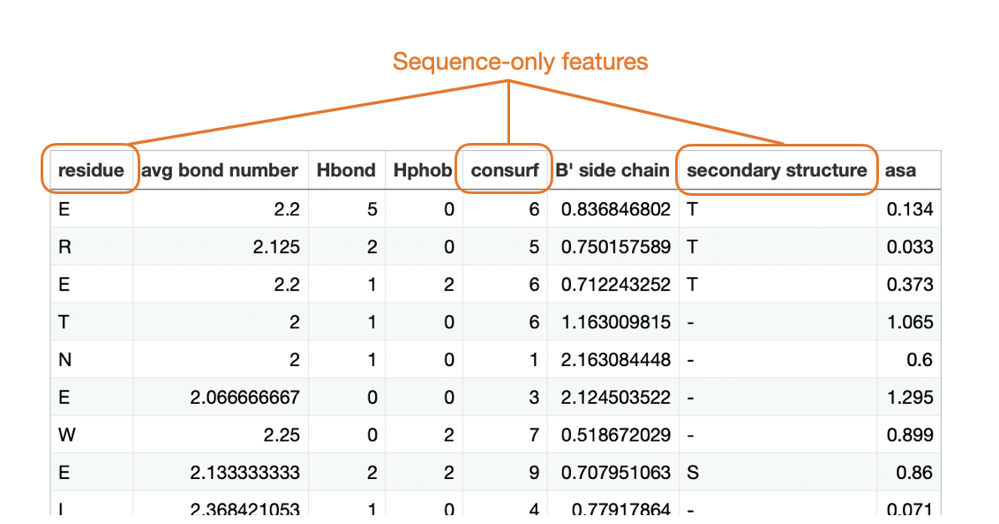

# Hotspotter

"Hotspotter is software used to classify energetic hot spots of protein:protein interaction given a set of 8 structure-based (all features) or 3 sequence-based features pre-calculated by the user for residues in the protein of interest. See the [manuscript](paper/Preprint_hotspotter_methods_validation_results.pdf) for details.  The code and datasets used in the manuscript are also provided. The default for hotspotter scripts is training on the training data the user provides.  Alldata (not the same as all features) refers to training on both the user's training and test sets, which gives results biased by prior knowledge of the test set and is not recommended."


## Setting Up the Computing Environment


1. Download and install the conda package manager from https://docs.conda.io/en/latest/miniconda.html


2. Create a new virtual environment


```
conda create -n hotspot python=3.9
conda activate hotspot
conda config --add channels conda-forge
```


## Using the Hotspotter Script


Install additional Python libraries via

```
conda install scikit-learn==1.1.2 numpy==1.23.3 pandas==1.4.4 --yes
```

Then navigate into the `hotspotter` subfolder:

```
cd hotspotter
```

and use the `hotspotter.py` script.

Get usage information by running `python hotspotter.py --help`:

```
$ python hotspotter.py --help
[OK] Your Python version is 3.9.13 | packaged by conda-forge | (main, May 27 2022, 17:01:00) 
[Clang 13.0.1 ]
[OK] sklearn 1.1.2
[OK] numpy 1.23.3
[OK] joblib 1.1.0
[OK] pandas 1.4.4
usage: hotspotter.py [-h] --csv_path CSV_PATH [--trained_model TRAINED_MODEL]
                     [--trained_model_sequence_only TRAINED_MODEL_SEQUENCE_ONLY] [--sequence-only {true,false}]

optional arguments:
  -h, --help            show this help message and exit
  --csv_path CSV_PATH   Path to the CSV file
  --trained_model TRAINED_MODEL
                        Path to the trained model
  --trained_model_sequence_only TRAINED_MODEL_SEQUENCE_ONLY
                        Path to the trained model for --sequence_only prediction.
  --sequence_only {true,false}
  --print_row_numbers {true,false}
```

<br>
<br>
<br>

You can run the hotspotter with 2 different classification models


### 1) Hotspotter trained on structural features

`mlp-allfeatures.joblib`: the multilayer perceptron trained with the best hyperparameter settings on the training set and as evaluated in the research paper. This model requires the feature columns  "avg bond number", "Hbond", "residue", "Hphob", "consurf", "B' side chain", "secondary structure",  "asa". See the   [[hotspotter/TestDataset.csv](hotspotter/TestDataset.csv)] file for details.

Run as

    python hotspotter.py \
    --csv_path TestDataset.csv \
    --trained_model mlp-allfeatures.joblib


### 2) Hotspotter trained on sequence features only

---

`mlp-seqfeatures.joblib`: Similar to `mlp-allfeatures.joblib`, but only requires sequence features: "residue", "consurf", "secondary structure":




Run as

    python hotspotter.py \
    --csv_path TestDataset.csv \
    --trained_model mlp-seqfeatures.joblib \
    --sequence_only true


---

(Note that `TestDataset.csv` is an example dataset we provide.)


The results will be formatted as follows:

```
==========
RESULTS
==========
1
1
1
0
0
...
1

```

Where each line corresponds to one row in the CSV file (1=hotspot, 0=not hotspot).


## Preparing Your Dataset

We recommend using the [ [hotspotter/TestDataset.csv](hotspotter/TestDataset.csv) ] file as guidance when preparing your own dataset. 

As mentioned in the previous section, the "Hotspotter trained on structural features" requires all columns of this dataset to be present. The "Hotspotter trained on sequence features only" only requires the following three columns: `residue`, `consurf`, `secondary structure`.

We strongly recommend using the same protocols we described in the paper (see the excerpts below) for obtaining the required features.


`avg bond number`, `Hbond`, `Hphob`, and `B' side chain`:

>  We used ProFlex v. 5.1, software created by our lab [25, 26] and available at https://github.com/psa-lab/ProFlex, to calculate three bond and contact features for each residue: average bond number (the average number of covalent, hydrophobic, and hydrogen-bond contacts for atoms in the residue), the number of hydrogen bonds formed (considering the detailed geometry and length of bonds involving the donor, hydrogen and acceptor atoms), and the number of interatomic hydrophobic contacts, referred to as hydrophobic tethers in ProFlex. One ProFlex feature that was calculated, average bond weight, was not kept in our classifiers because it did not enhance the quality of prediction. To determine the energy level for use in ProFlex for calculating features, the Hether script distributed with ProFlex was used to identify the energy at which the number of rigid clusters of protein atoms changed most.
>
> [...] crystallographic temperature factor values, also known as B factors or B values, which experimentally quantify the mobility of each atom in the crystal structure, were extracted from the PDB file. The B values were used to calculate B’ for the side chain, in which the B values of the atoms in each side chain are averaged and divided by the average B value of all side chains in the protein, and then normalized by the average side-chain occupancy values for the same atoms. The occupancy data is also provided in PDB files [27]. This B’ normalization scales mobility values so they are on a consistent scale in different PDB entries [27, 28].


`consurf`:

> To measure residue conservation, we used the online ConSurf server (https://consurf.tau.ac.il; [30]) in default mode to generate a multiple sequence alignment of diverse homologs for each of the 97 PDB files in our dataset and assign a conservation value to each residue (from 1=most variable in amino acid type in the multiple sequence alignment to 9=most conserved).


`asa` and `secondary structure`:

> The final two residue features, accessible surface area (ASA) in the protein:protein complex and secondary structure type were calculated for the wild-type residue in each site with GROMACS version 2021.2. The four-state secondary structure type (T for turn, H for helix, S for strand, and – for other) was computed using the DSSP option in GROMACS [31–33], and the solvent accessible surface area was calculated using SASA in GROMACS [34]


## Using the Experiments Notebooks

In order to run the code in the experiment notebooks, install the following additional Python libraries:

```
conda install \
scikit-learn==1.1.2 \
jupyterlab \
watermark==2.3.1 \
matplotlib==3.5.3 \
numpy==1.23.3 \
pandas==1.4.4 \
mlxtend==0.21.0 \
--yes
```


Next, start JupyterLab and use notebooks via the command


```
jupyter lab
```

